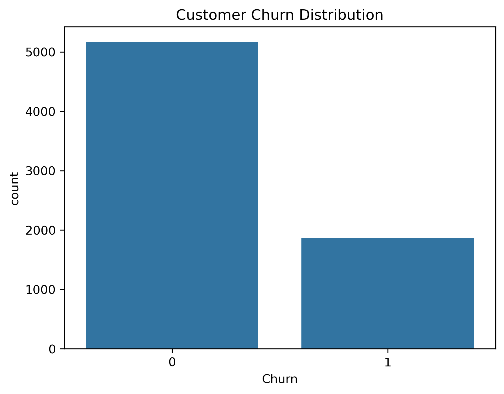
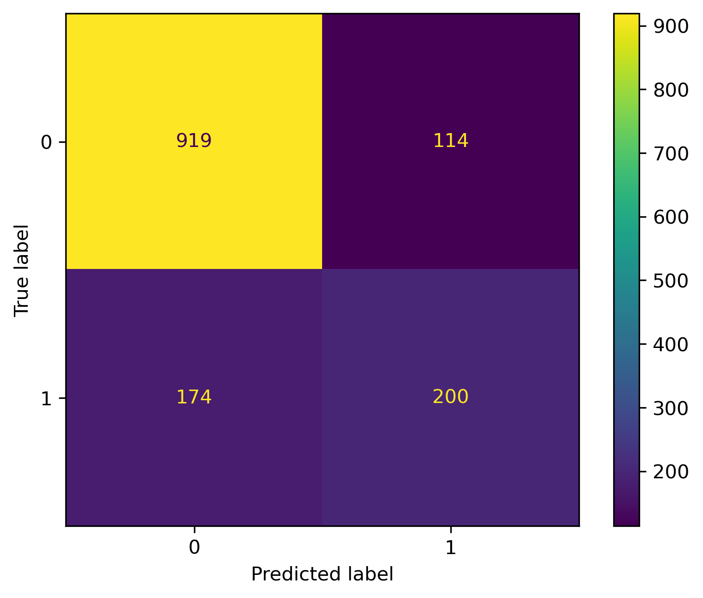
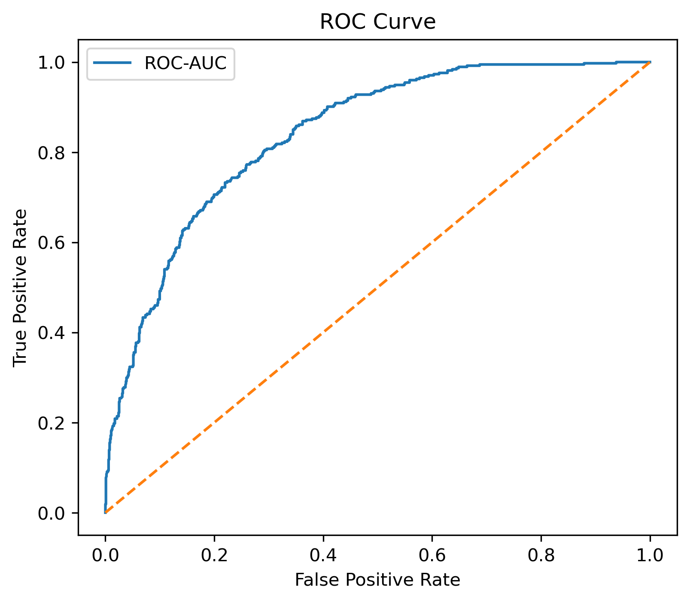
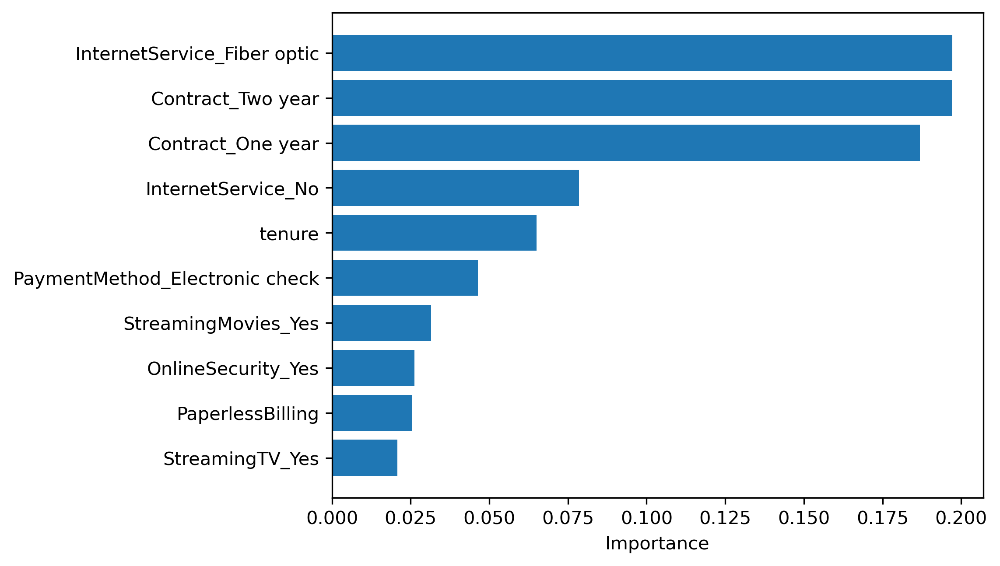

# 📊 Customer Churn Prediction using Machine Learning


## 📌 Project Overview

Customer churn is one of the biggest challenges faced by subscription-based businesses such as telecom companies. This project aims to predict whether a customer is likely to leave the company based on demographic information, account details, and service usage.

Several machine learning algorithms were implemented, compared, and evaluated to identify the best-performing model.

---

## 🎯 Problem Statement

The objective of this project is to build a machine learning model that can accurately predict customer churn, allowing businesses to identify at-risk customers and take proactive retention measures.

---

# 📂 Dataset Information

**Dataset:** Telco Customer Churn

**Source:** Kaggle

**Total Customers:** 7,043

**Target Variable**

- Churn (Yes / No)

### Features

- Gender
- Senior Citizen
- Partner
- Dependents
- Tenure
- Phone Service
- Internet Service
- Contract Type
- Payment Method
- Monthly Charges
- Total Charges
- and more...

---

# 🛠 Technologies Used

- Python
- NumPy
- Pandas
- Matplotlib
- Seaborn
- Scikit-learn
- XGBoost
- Joblib
- Jupyter Notebook

---

# 📈 Machine Learning Workflow

```
Dataset
      │
      ▼
Data Cleaning
      │
      ▼
Exploratory Data Analysis
      │
      ▼
Feature Engineering
      │
      ▼
Train-Test Split
      │
      ▼
Model Building
      │
      ▼
Hyperparameter Tuning
      │
      ▼
Model Evaluation
      │
      ▼
Best Model Selection
```

---

# 📊 Exploratory Data Analysis

Performed detailed EDA including:

- Dataset Exploration
- Missing Value Analysis
- Duplicate Record Check
- Data Type Conversion
- Target Variable Analysis
- Numerical Feature Analysis
- Categorical Feature Analysis
- Correlation Heatmap
- Outlier Detection

---

# ⚙ Data Preprocessing

The following preprocessing techniques were applied:

- Handling Missing Values
- Label Encoding
- One-Hot Encoding
- Feature Selection
- Train-Test Split
- Data Scaling (where required)

---

# 🤖 Models Implemented

✔ Logistic Regression

✔ Decision Tree

✔ Random Forest

✔ XGBoost

---

# 📏 Evaluation Metrics

Models were evaluated using:

- Accuracy
- Precision
- Recall
- F1 Score
- Confusion Matrix
- ROC-AUC Score
- Cross Validation
- Feature Importance

---

# 🏆 Model Performance

| Model | Accuracy | ROC-AUC |
|--------|---------:|---------:|
| Logistic Regression | 79.0% | 0.846 |
| Decision Tree | 77.8% | 0.827 |
| Random Forest | 79.5% | 0.839 |
| **XGBoost** | **79.5%** | **0.840** |

---

# 🥇 Best Model

After comparing all machine learning models, **XGBoost** was selected because it provided:

- Highest ROC-AUC Score
- Excellent Cross Validation Performance
- Strong Generalization
- Stable Predictions
- Better Overall Classification Performance

---

# 💡 Key Business Insights

- Customers with **Month-to-Month Contracts** are more likely to churn.
- Customers with **Short Tenure** show a higher probability of churn.
- **Monthly Charges** significantly influence customer churn.
- **Contract Type** is one of the strongest predictors.
- **Internet Service Type** also contributes to churn behavior.

---

# 📷 Project Outputs

- Class Distribution
  
  
- Confusion Matrix
  
  
- ROC Curve
  
  
- Feature Importance Graph
  

---

# 📁 Project Structure

```
Customer-Churn-Prediction/
│
├── data/
│   └── customer_churn.csv
│
├── notebooks/
│   └── Customer_Churn_Prediction.ipynb
│
├── images/
│   ├── correlation_heatmap.png
│   ├── confusion_matrix.png
│   ├── roc_curve.png
│   └── feature_importance.png
│
├── models/
│   └── xgboost_model.pkl
│
├── requirements.txt
├── README.md
└── .gitignore
```

---

# 🚀 Future Improvements

- LightGBM Implementation
- CatBoost Comparison
- Optuna Hyperparameter Optimization
- SHAP Explainability
- Streamlit Web Application Deployment

---

# 👨‍💻 Author

## Yash Patel

**Aspiring Data Scientist | Machine Learning Enthusiast**

- 💼 LinkedIn: *(https://www.linkedin.com/in/yash-patel-67a885366/)*
- 💻 GitHub: *((https://github.com/Yashpatel187)*

---

## ⭐ Support

If you found this project helpful, consider giving it a **Star ⭐** on GitHub.
